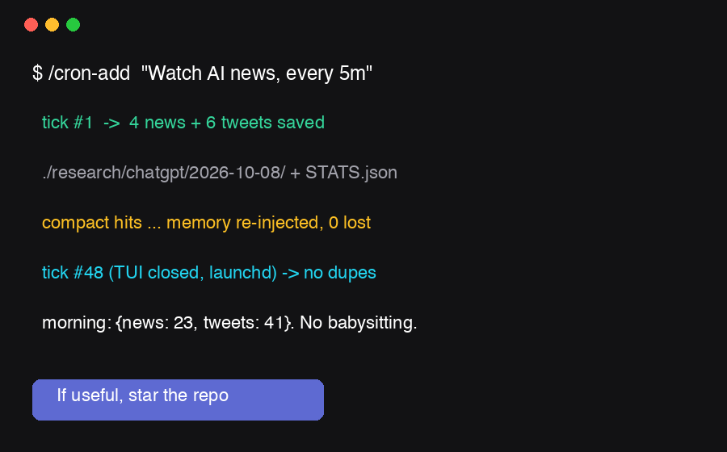
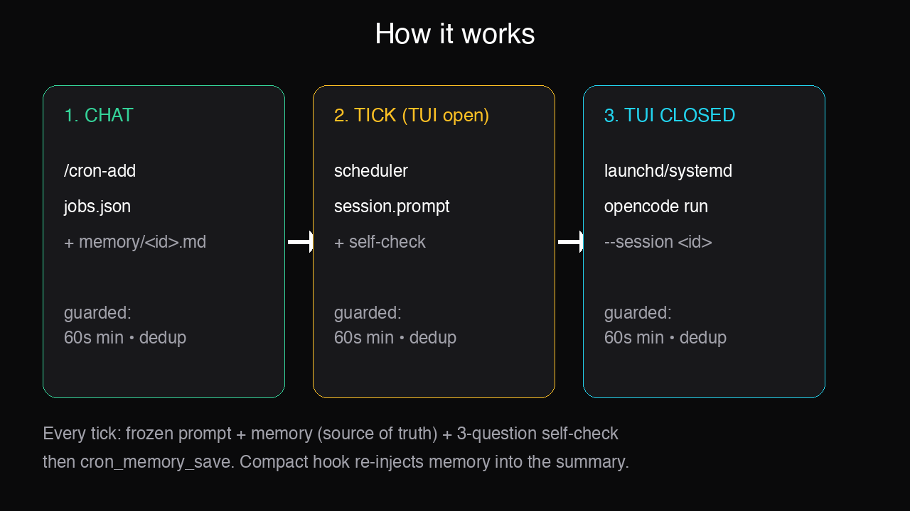

<p align="center">
  
</p>

# ⏰ opencode-cron — ChatGPT Scheduled Tasks for opencode

ChatGPT has Scheduled Tasks. opencode didn't. Until now.

Tell opencode **“watch this every 5 minutes”** — and it actually does. Same session. Even after compact. Even with TUI closed.

[](https://www.npmjs.com/package/@culturedigitali/opencode-cron)
[](https://www.npmjs.com/package/@culturedigitali/opencode-cron)
[](LICENSE)
[](https://github.com/CultureDigitali/opencode-cron/actions/workflows/ci.yml)
[](https://bun.sh)
[](https://nodejs.org)
[](https://github.com/CultureDigitali/opencode-cron/stargazers)
[](https://github.com/CultureDigitali/opencode-cron/commits/main)
[](https://opencode.ai)

**opencode-cron is session-bound cron + persistent memory for opencode — an AI agent scheduler, not a dumb shell timer.**

- **Same chat, every tick:** re-prompts your `sessionID` with full history — not a shell command
- **Never loses context:** per-job memory survives compact + restarts, with dedup built-in
- **Works TUI-closed:** launchd / systemd / schtasks runner keeps jobs alive overnight

If it saved you a tab, ⭐ star it — it helps a lot.

## 30-second quickstart

```jsonc
// opencode.json
{ "$schema": "https://opencode.ai/config.json", "plugins": ["@culturedigitali/opencode-cron"] }
```

In chat:

```
/cron-add → "Watch AI news, every 5m"
```

Keep running with TUI closed:

```bash
npx @culturedigitali/opencode-cron os-install --dir /path/to/project
```

Working for you? ⭐ Star to lock this pattern in — 2 seconds, huge signal.

## See it in action

BEFORE: you keep the tab open, refresh X/news, copy-paste, lose everything on compact.



1. You: `/cron-add` → “Watch AI news, every 5m”
2. Tick 1: opencode searches, saves to `./research/chatgpt/2026-10-08/`, calls `cron_memory_save`
3. Tick 12: compact hits — memory re-injects, zero context lost
4. Tick 48: TUI closed overnight — launchd wakes it, no dupes via `seenHashes`
5. Morning: `STATS.json` = `{news: 23, tweets: 41}`. You read. No babysitting.

Template: [`templates/news-tweet-watch.md`](templates/news-tweet-watch.md) · Self-contained starter (no browser/MCP/network): [`templates/repo-guardian.md`](templates/repo-guardian.md) · Full guide: [`docs/quickstart.md`](docs/quickstart.md)

## Why not plain cron?

| Plain cron | opencode-cron |
|---|---|
| runs a shell command | re-prompts the **same `sessionID`** with full history |
| loses context on compact | **per-job memory** file survives compact + restarts |
| duplicates work | `seenHashes` dedup + `skipIfRunning` + atomic locks |
| expensive loops | 60s minimum, jitter, 5-fail auto-pause, `maxRuns` |

## AI agent scheduler — how it works



```
chat (/cron-add, cron_add tool)
  └─> .opencode/cron/jobs.json + memory/<id>.md
        ├─> TUI open: in-process scheduler → ctx.session.prompt({ sessionID, text })
        └─> TUI closed: launchd/systemd/cron/schtasks → opencode-cron-run check → opencode run --session <id>
```

Every tick injects:

1. frozen system prompt
2. persistent memory (source of truth after compact)
3. mandatory 3-question self-check before acting
4. followup task, then `cron_memory_save`

Compaction hook (`ctx.session.hook("compaction")`) re-injects the memory into the summary. Details: [`docs/how-it-works.md`](docs/how-it-works.md) · [`docs/opencode-persistent-memory-cron.md`](docs/opencode-persistent-memory-cron.md)

## Tools (9)

| Tool | What |
|---|---|
| `cron_add` | create job (`every: 5m` or `cron: */5 * * * *`), bound to current session |
| `cron_list` / `cron_get` | list / inspect |
| `cron_pause` / `cron_resume` / `cron_remove` | lifecycle (remove also cleans memory + logs) |
| `cron_run_now` | immediate test tick |
| `cron_memory_read` / `cron_memory_save` | persistent memory (required after each run) |

Slash commands: `/cron-add`, `/cron-list`, `/cron-manage`. Examples: [`docs/examples.md`](docs/examples.md)

## Runs with TUI closed

```bash
npx @culturedigitali/opencode-cron os-install --dir /path/proj  # macOS plist / linux systemd+crontab / windows schtasks
npx @culturedigitali/opencode-cron check --dir /path/proj
npx @culturedigitali/opencode-cron run <jobId> --dir /path/proj
```

Guards: min interval 60s, max 20 jobs/project, prompt caps, no catch-up by default, atomic locks. OS guide: [`docs/opencode-cron-launchd-systemd.md`](docs/opencode-cron-launchd-systemd.md) · Troubleshooting: [`docs/troubleshooting.md`](docs/troubleshooting.md)

## Use cases

| Case | Every | Result |
|---|---|---|
| AI news + X watcher | `5m` | New items only in `./research/chatgpt/YYYY-MM-DD/` + `STATS.json` |
| Competitor / price monitor | `15m` | Diff alert in same session, no duplicate pings |
| CI / flaky test re-check | `10m` | Re-runs prompt, auto-pauses after 5 fails |
| Docs / changelog digest | `1h` | Daily markdown summary, compact-safe |
| Inbox / lead triage | `*/30 * * * *` | Top 10 new only, memory tracks `seenHashes` |
| Repo health guardian | `30m` | git + tests + TODO snapshot only on change, zero deps ([template](templates/repo-guardian.md)) |

More: [`docs/ai-agent-cron-jobs.md`](docs/ai-agent-cron-jobs.md) · vs ChatGPT: [`docs/chatgpt-scheduled-tasks-opencode.md`](docs/chatgpt-scheduled-tasks-opencode.md) · vs cron: [`docs/comparison.md`](docs/comparison.md)

## FAQ

**Will this burn tokens in a loop?**
No. 60s minimum, jitter, `skipIfRunning`, locks, `maxRuns`, 5-fail auto-pause, max 10 items/tick. `cron_run_now` to test before you commit.

**Is it safe to auto-execute prompts?**
Treat `.opencode/cron/jobs.json` + `memory/*.md` like code. The model runs them on schedule. Never put secrets in prompts/memory. See [`SECURITY.md`](SECURITY.md).

**Does it really work with TUI closed?**
Yes. `os-install` → launchd/systemd/schtasks + `check` every minute. TUI-open = in-process, TUI-closed = OS runner. Same `sessionID`.

**What happens on context compact?**
Nothing lost. The `compaction` session hook (`ctx.session.hook("compaction")`) re-injects `memory/<id>.md` into the summary. Memory is source of truth, not chat history.

**Will I get duplicate runs / spam?**
No. `seenHashes` dedup + atomic locks + `skipIfRunning: true` + no catch-up by default. Zero-news tick just updates `lastRun`.

**Why not just use cron + script?**
Plain cron loses session, loses memory on compact, dupes work, and has no guards. This re-prompts the same session with frozen system prompt + memory + 3-question self-check.

## Trust boundary

Treat `.opencode/cron/jobs.json` + `memory/*.md` like code: the model executes them on schedule. Never paste secrets into prompts or memory. See [`SECURITY.md`](SECURITY.md).

## Contribute

PRs welcome — see [`CONTRIBUTING.md`](CONTRIBUTING.md). Run `bun install && bun test && bun run typecheck && bun run build` before pushing. Changelog in [`CHANGELOG.md`](CHANGELOG.md). Use the templates: [`SECURITY.md`](SECURITY.md) for vulns, [`docs/troubleshooting.md`](docs/troubleshooting.md) before opening issues.

---
Built something cool with a cron job? PR the template + ⭐ star so others find it.
